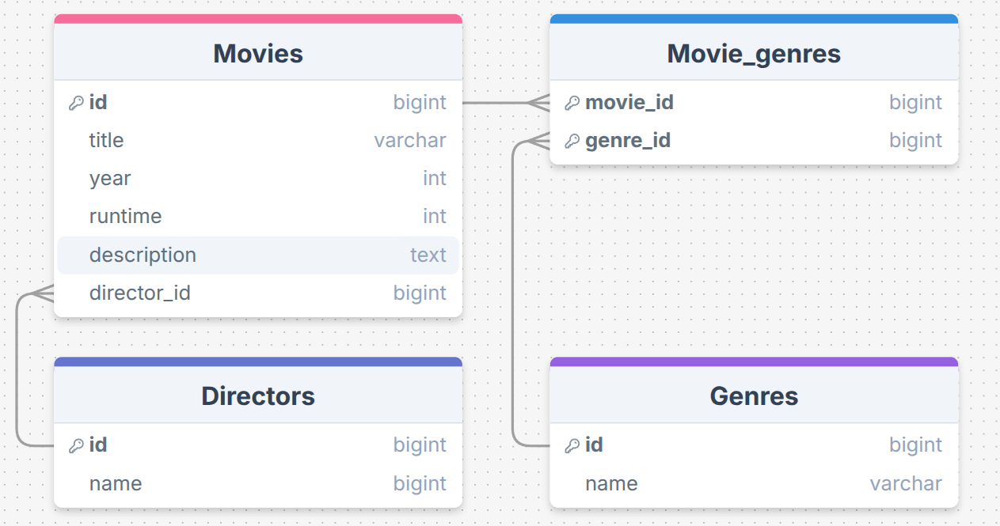

# Movie Inventory App

A CRUD application for managing a movie database, focusing on relational data structures and server-side rendering.


## Skills Sharpened

- **Database Design:** Implementing One-to-Many (Movies-Directors) and Many-to-Many (Movies-Genres) relationships in PostgreSQL.
- **SQL Mastery:** Writing complex queries with json_agg, subqueries, and managing data integrity with SQL Transactions (BEGIN/COMMIT).
- **Backend Architecture:** Organizing code using the MVC pattern and handling asynchronous flow with Node.js.
- **Data Security:** Implementing server-side validation, sanitization (XSS protection), and handling Unique Constraints at the database level.

## Project Structure
```
├── package.json
├── package-lock.json
├── public
│   ├── image.png
│   └── styles.css
├── README.md
└── src
    ├── app.js
    ├── controllers
    │   ├── directorsController.js
    │   ├── genresController.js
    │   └── moviesContoller.js
    ├── db
    │   ├── directorsQueries.js
    │   ├── genresQueries.js
    │   ├── moviesQueries.js
    │   ├── pool.js
    │   ├── populatedb.js
    │   └── queries.js
    ├── routes
    │   ├── directorsRouter.js
    │   ├── genresRouter.js
    │   ├── moviesRouter.js
    │   └── router.js
    └── views
        ├── index.ejs
        ├── movieForm.ejs
        └── partials
            ├── directors.ejs
            ├── genres.ejs
            └── movies.ejs
```

## Database Schema


## Libraries Used

- **express:** Web framework for routing and middleware.
- **pg:** PostgreSQL client for query execution and transaction management.
- **ejs:** Template engine for rendering views.
- **express-validator:** Data validation and sanitization.
- nodemon: Development tool for automatic restarts.

## Getting Started
Install dependencies:
```bash
npm install
```

Initialize Database:
Configure src/db/pool.js with your PostgreSQL credentials, then run:
```bash
npm run setupDB
```

Run Application:
```bash
npm run dev
```

Access the app at http://localhost:3000.
